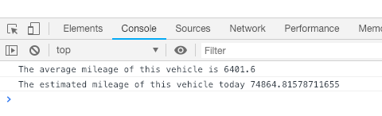
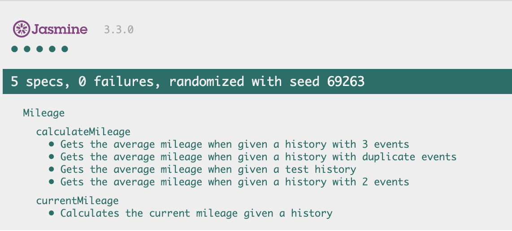

# Cazana
At Cazana, our biggest strength is being able to to combine disparate pieces of information about a vehicle from different sources and generating new insights.

In order to calculate the valuation of a vehicle, one of the things we need is an estimate of its current mileage. We do this by looking at data points in the vehicle’s history to estimate the vehicle’s average annual mileage. From there we project forward from the most recent event to work out how many miles it will have likely done until now. We calculate the annual mileage between the data points and then take the average of those.

## The Challenge
Given the all the MOT’s in a vehicle’s history, you must create two functions - in Javascript - which:
* Calculate the average annual mileage using the events in the timeline.
* Estimate the vehicle’s current mileage by projecting from the most recent, event using the average annual mileage.

## Using this app
1. `git clone https://github.com/Caitlin-cooling/Cazana.git`
2. `cd Cazana`
3. `npm install`
4. Open `index.html` in your browser
5. Open your Developer Tools console to see the requested results

## Tests
This app was written using TDD, and the testing framework used was Jasmine. To run the tests, please open `SpecRunner.html` in your browser.

## My Approach to solving this problem
As mentioned, I used TDD to break down the problems in to smaller chunks to solve it efficiently. I have found that using the TDD principle of "writing the minimal amount of code to pass the test" often results in clean, minimal code with expected behaviour.

By using this approach I was able to spot edge cases such as when the history has multiple entries from the same date that can effect the results.

I decided that 'today' should be initiliazed in the constructor, where a specific date can either be passed in as an argument, say for example you wanted to find the mileage on a certain day, or if no value is given todays date and time will be used. This allows maximum flexibility for the user, but also allows a high test coverage to be achieved.

## Linting
Linting was completed using ESLint and a popular styleguide.

## Without Time Restriction I would have...
Liked to implement a user interface.

From looking at the data that was given, it seemed that the MOT date, was always given with a date and time of 00:00:00.000. I have made the assumption that they will always be a date rather than a date and specific time, but given more time I would handle this edge case.
